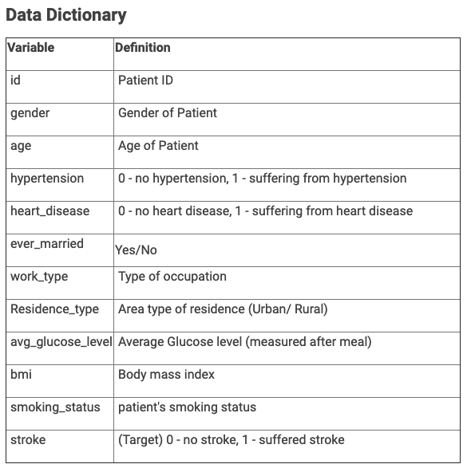

# Ascend Pro ML Basics Hackathon
### Problem Statement
Client of next generation healthcare is looking for ability to further study the critical disease 'Stroke'.
A stroke affects the arteries, which may affect the brain and lead to other physical impairements. Our goal for this hackathan is predict the 
probability of stroke happening to a patient. This will inevitably help future doctors better assess their patients' health and perform proactive tests.

Main jupyter notebook is 'ml_basics_main_notebook.ipynb', with complementary preprocessing.py and utils.py to perform Exploratory Data Analysis (EDA) and preprocessing of data.

Completed Hackathon with subimssion file.
* Public Leaderboard: 17th 
* Private Leaderboard with 70% witheld test dataset: Khoin 4th

